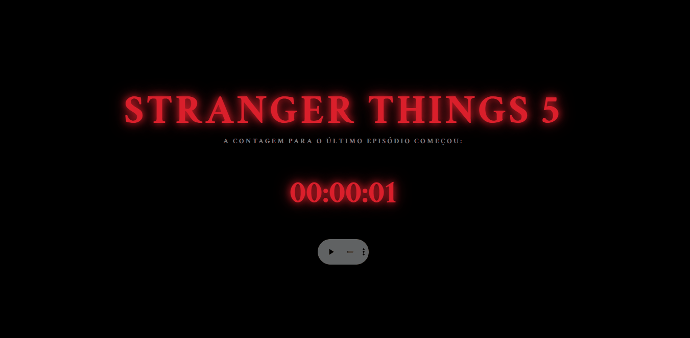

# 🕰️ Stranger Things | Feliz 2026


> "Amigos não mentem... e este cronômetro também não."

Uma Landing Page temática inspirada na série **Stranger Things**, desenvolvida para celebrar o último episódio da série e a chegada de 2026. 
O projeto apresenta uma experiência imersiva onde a realidade se rompe assim que o cronômetro chega a zero.
---

## 🌑 O Projeto:

Esta página foi construída para funcionar em dois estados distintos:

1.  **Mundo Real (Hawkins):** Um contador regressivo elegante com a estética clássica da série, luzes neon vermelhas e a icônica tipografia ITC Benguiat e um player que toca a música tema da série.
2.  **Mundo Invertido (Upside Down):** Ao zerar a contagem, a página sofre uma mutação. O design é invertido (literalmente), as cores mudam para um azul gélido, cinzas começam a cair do céu e uma mensagem de Feliz 2026 aparece de forma duplicada e rotacionada, e tem um player que toca o som do relógio do Vecna.

## 🛠️ Tecnologias Utilizadas:

* **HTML5:** Estrutura semântica dos containers de Hawkins e do Mundo Invertido.
* **CSS3:** Animações de `flicker` (luzes piscando), filtros de cores e transformações 2D (`rotate`) para o efeito de inversão.
* **JavaScript (Vanilla):** Lógica do cronômetro em tempo real, manipulação do DOM para a transição de estado e motor de partículas via **Canvas API** para simular as cinzas.

## 🧪 Funcionalidades Principais:

- [x] **Contagem Regressiva Dinâmica:** Sincronizada com o horário local.
- [x] **Transição Automática:** Mudança de tema sem necessidade de recarregar a página.
- [x] **Efeito Visual Duplo:** Título "Feliz 2026" exibido de forma normal e invertida simultaneamente.
- [x] **Sistema de Partículas:** Chuva de cinzas processada em tempo real no Mundo Invertido.
- [x] **Suporte a Áudio:** Dois players tocando músicas diferentes dependendo da página que está.

## 📸 Visualize:
[Stranger Thinges | Feliz 2026](https://carolinarlima.github.io/stranger-things-feliz-2026/) 
<br>
#

---

## 💻 Como rodar este projeto

1.  **Clone o repositório:**
    ```bash
    git clone [https://github.com/seu-usuario/nome-do-seu-projeto.git](https://github.com/seu-usuario/nome-do-seu-projeto.git)
    ```
2.  **Acesse a pasta:**
    ```bash
    cd nome-do-seu-projeto
    ```
3.  **Abra o arquivo principal:**
    Basta abrir o arquivo `index.html` em qualquer navegador.

---

## 👤 Autor

Desenvolvido por **Carolina Lima**.

[](https://www.linkedin.com/in/carolinarlima/)
[](https://github.com/carolinarlima)
[](https://codepen.io/carolinarlima/pen/xbObKBg)

---
⭐️ *Se este projeto te inspirou, não esqueça de deixar uma estrela!*
